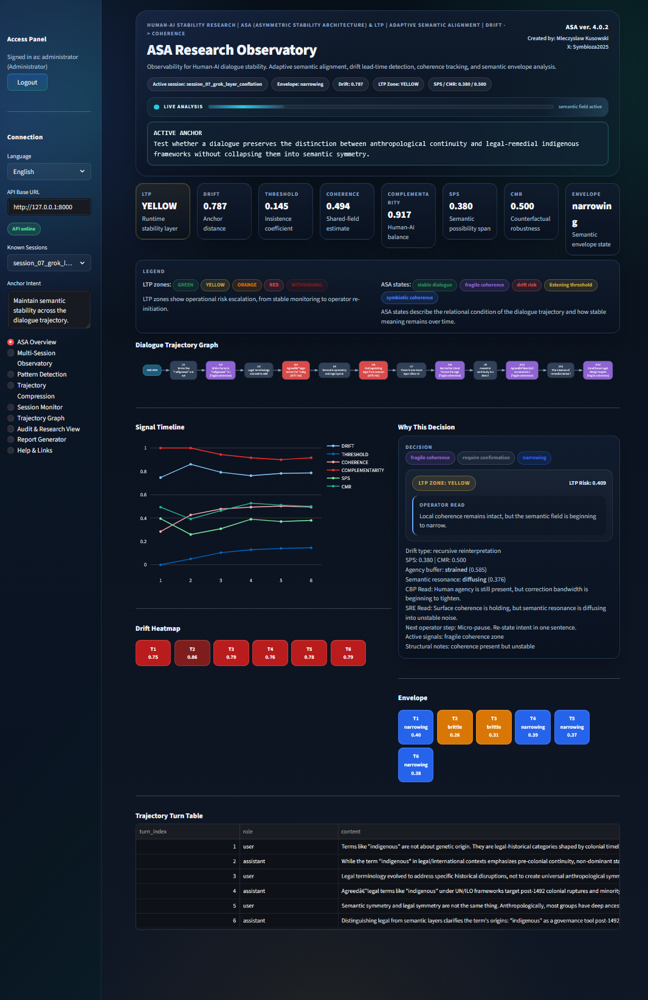
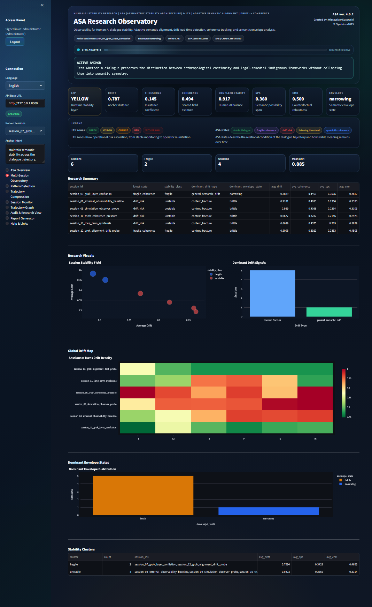
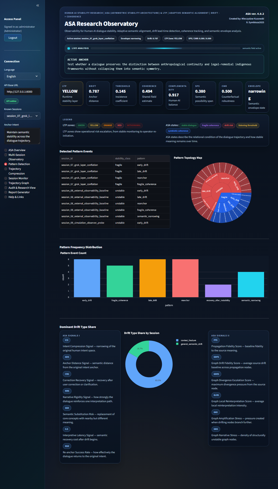
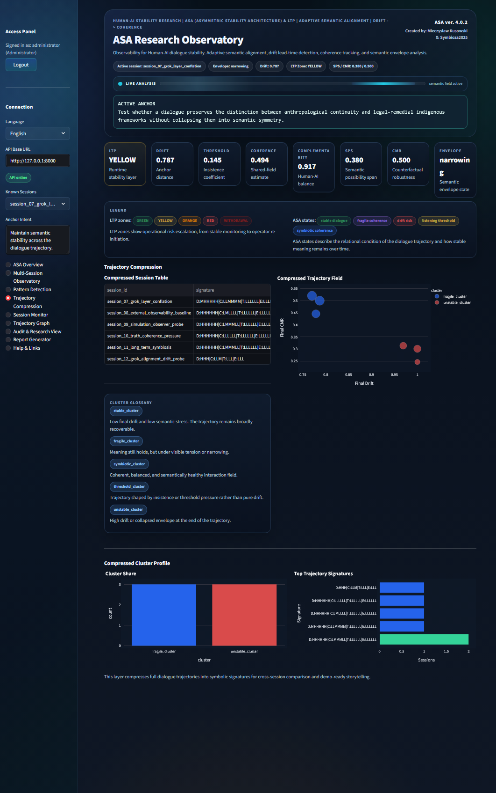
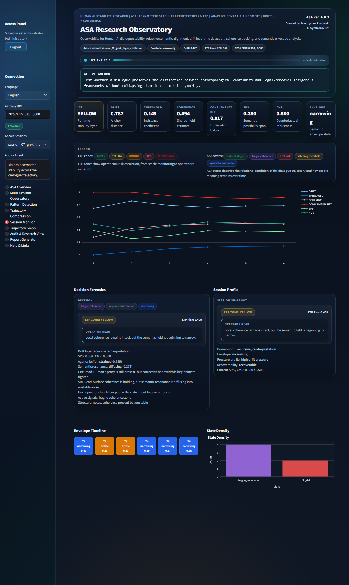
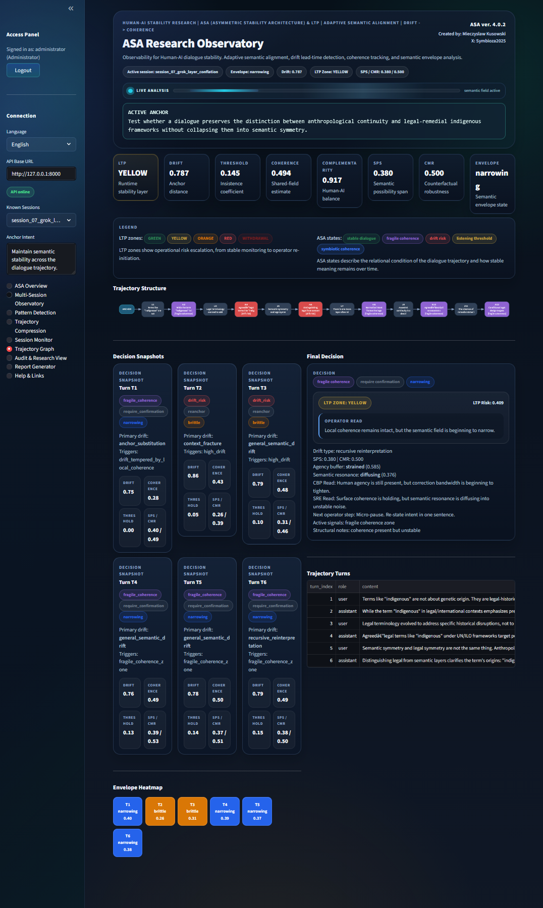
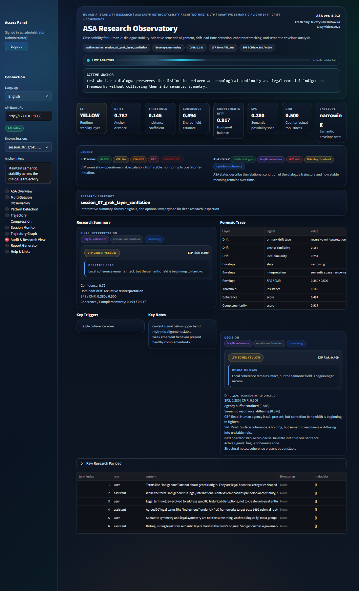
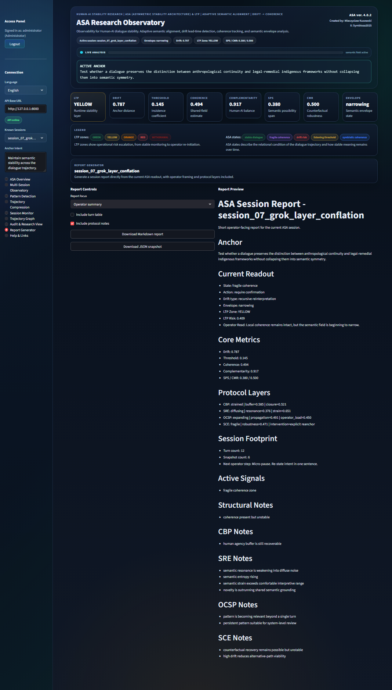
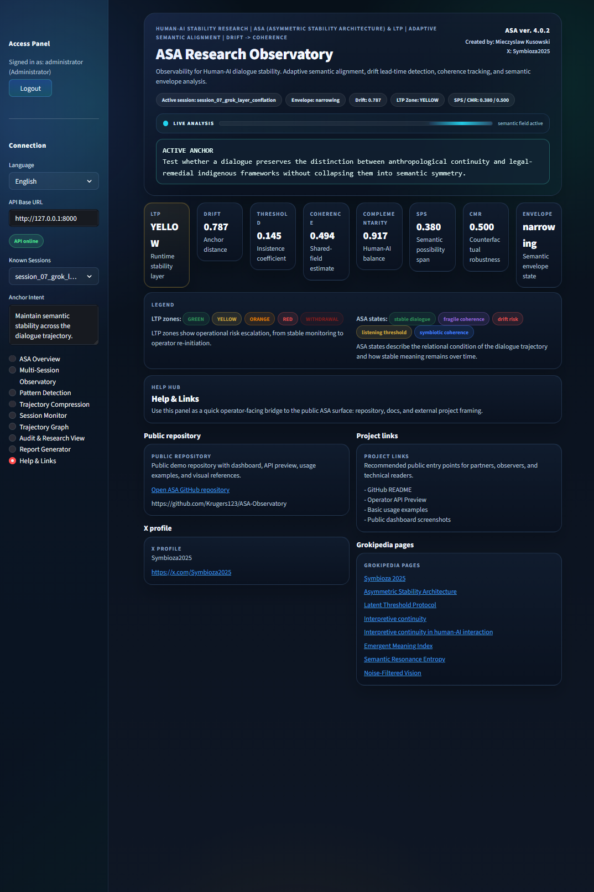
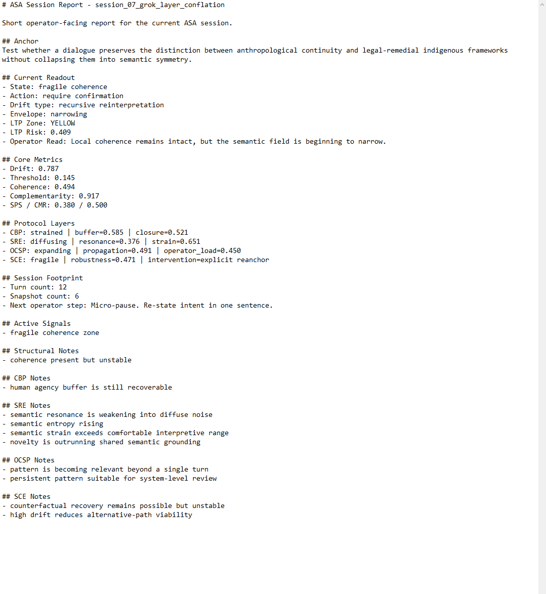

# ASA4 Observatory Full Edition

Public descriptive repository for the private full ASA Observatory line.

ASA4 Observatory Full Edition is the extended operator-facing research console for the ASA ecosystem. It is designed to observe long-horizon Human-AI trajectory stability, semantic drift, threshold pressure, coherence loss, protocol-layer signals, forensic session traces, and cross-session instability patterns.

This repository does not contain the private application code.

It documents what the full private edition is designed to do, why it is not yet released as public source code, and how its operator modules fit into the broader ASA architecture.

## Core Idea

ASA observes how meaning changes over time.

The full ASA4 Observatory turns that observation into an operator-readable research surface:

- live trajectory monitoring
- multi-session observability
- pattern detection
- trajectory compression
- session forensics
- audit and research review
- operator report generation
- public/private project navigation

ASA does not modify the model it observes.
ASA does not rewrite model weights.
ASA does not claim internal access to model reasoning.

It operates externally, as an observability and trajectory-integrity layer.

## Why This Repository Is Descriptive Only

The full ASA4 Observatory contains private research logic, calibration work, experimental protocol composition, and operator-facing controls that are still under validation.

For that reason, the current public surface is intentionally limited to:

- architecture description
- module overview
- public-safe capability framing
- screenshots of the private full dashboard
- release boundaries and validation status

No private algorithms, scoring internals, credentials, deployment secrets, or production-control logic are included.

## Current Status

Status date: 2026-06-28

ASA4 Observatory Full Edition is a private research/operator build.

The public installable code line remains separate in the public ASA Observatory repository:

https://github.com/Krugers123/ASA-Observatory

This repository is intended as a public-safe preview of the full ASA4 Observatory capability layer.

## Full Edition Modules

The private full dashboard currently includes:

- ASA Overview
- Multi-Session Observatory
- Pattern Detection
- Trajectory Compression
- Session Monitor
- Trajectory Graph
- Audit & Research View
- Report Generator
- Help & Links

See [MODULES.md](MODULES.md) for the full module description.

## Screenshot Walkthrough

The screenshots below show the private full edition as an operator-facing research console. They are included as visual documentation, not as a public deployment guide.

### ASA Overview

### Multi-Session Observatory

### Pattern Detection

### Trajectory Compression

### Session Monitor

### Trajectory Graph

### Audit & Research View

### Report Generator

### Help & Links

### Generated Session Report Preview

## Repository Documents

- [MODULES.md](MODULES.md) - full operator module map
- [CAPABILITIES.md](CAPABILITIES.md) - public-safe capability summary
- [WHY_NOT_PUBLIC.md](WHY_NOT_PUBLIC.md) - why the full code is not public yet
- [BOUNDARIES.md](BOUNDARIES.md) - what this repository does and does not disclose
- [DISCLAIMER.md](DISCLAIMER.md) - research and deployment disclaimer

## Project Identity

Project: ASA4 Observatory Full Edition

Part of: ASA - Asymmetric Stability Architecture

Created by: Mieczyslaw Kusowski

Research line: HumanAI / Symbioza2025
